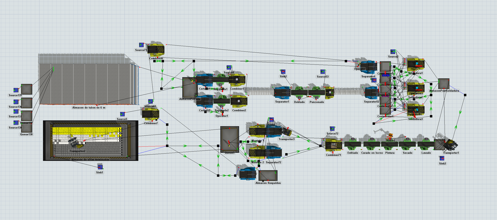
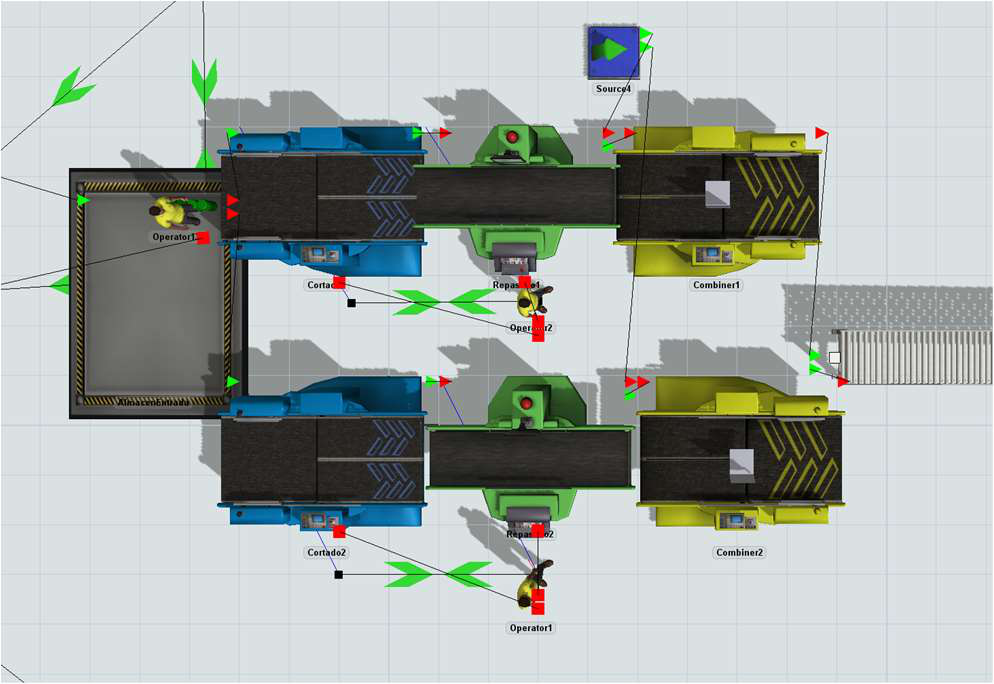
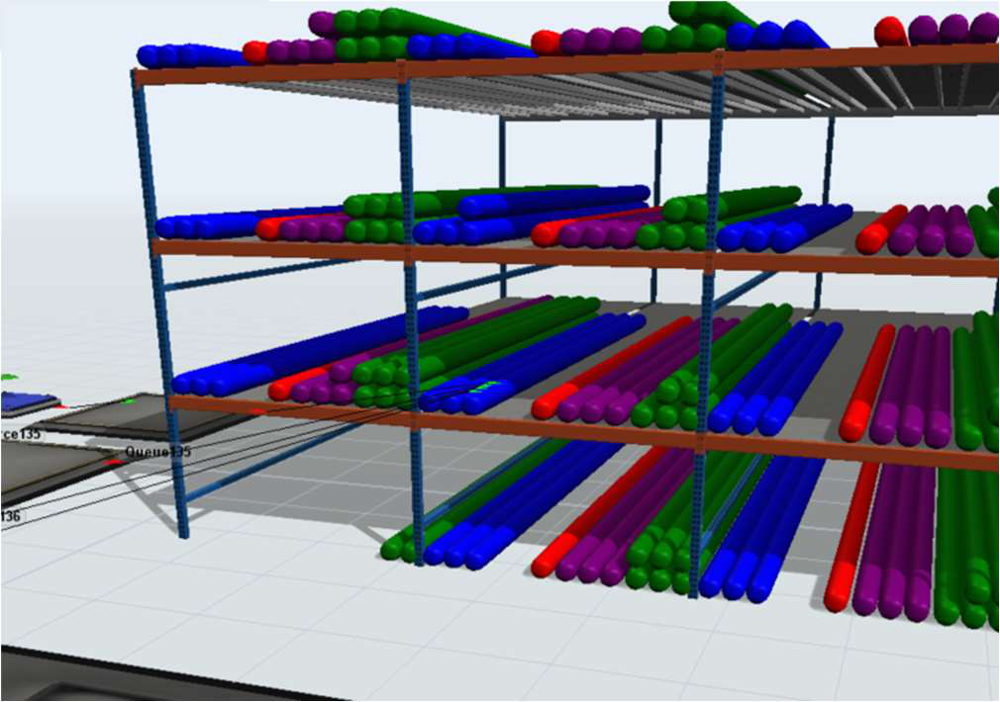

# Metal Chair Factory — FlexSim simulation

Discrete-event simulation of a **metal chair factory**, built in **FlexSim** to model the full production line, measure each section's cycle time and efficiency, and propose an improvement that reduces the order's delivery time.

Project developed for the **Integrated Manufacturing Systems** course (Master's, 1st semester — ETSII, UPM).



---

## The problem

Produce an order of **600 chairs** — 300 grey, 200 silver and 100 white — and analyse the manufacturing time and the efficiency of each section.

The plant is divided into **7 sections**:

1. Reception, raw-material warehouse and material preparation
2. Cutting
3. Forming
4. Welding
5. Painting
6. Assembly
7. Finished-goods warehouse and dispatch

Constraints from the statement: manual operations carry a **±10 % variation**; raw material has a **2–3 day** lead time; maximum capacity of **180 chairs**; after each operation parts are unloaded into containers.

---

## Modelling approach

- **Raw material:** 6 m tubes of two profiles (20×10 and 18×18); each profile is cut to two lengths, yielding **4 piece types**. To simplify routing, the material enters through 4 separate sources and is stored across 32 warehouse sections.
- **Data:** five global tables hold the setup and process times of each machine. The ±10 % variation is applied to manual operations only (load/unload and the machine-driven cutting and painting times are excluded).
- **Flow:** sources → cutting → forming → welding → painting → assembly → finished-goods dispatch, with separators/combiners handling pallets between stages.
- **Analysis:** per-section cycle time and efficiency, total order completion time, and bottleneck identification.
- **Improvement:** an alternative model (`chair-factory-improved.fsm`) that reduces the order delivery time.

| Section detail | Raw-material warehouse |
|:---:|:---:|
|  |  |

---

## Repository structure

```
chair-factory-flexsim/
├── model/
│   ├── chair-factory.fsm            Final FlexSim model
│   └── chair-factory-improved.fsm   Improved model (reduced delivery time)
├── iterations/                      Model iterations (Prueba_7 … Prueba_20), showing the build-up
├── docs/
│   ├── memoria.pdf                  Technical report (Spanish)
│   ├── enunciado.pdf                Assignment statement (Spanish)
│   ├── presentacion.pptx            Presentation slides (Spanish)
│   └── datos.xlsx                   Times and data tables
└── media/                           Screenshots from the model
```

> The models are **FlexSim** (`.fsm`) files — open them in FlexSim to run the simulation. The report and presentation document the layout, data, results and the improvement proposal.

---

## Tech stack

`FlexSim` · `Discrete-event simulation` · `Manufacturing systems` · `Process/efficiency analysis`

---

## Authors

Team project — Integrated Manufacturing Systems, Master's in Industrial Engineering, ETSII (UPM).

Leyre Cerrillo · Javier Pulido · Pablo Lecocq · Elisa Oyaregui.
